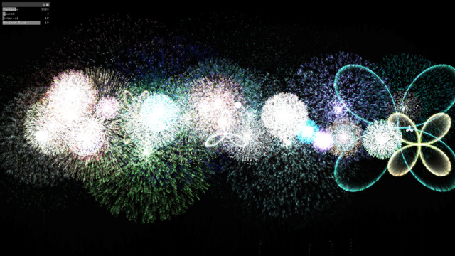
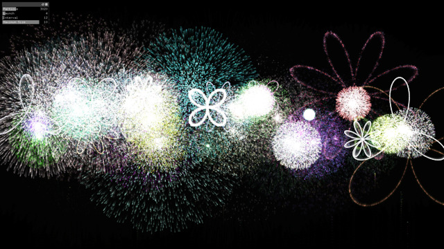
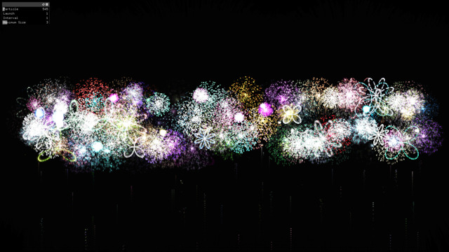

# Fireworks
Simple fireworks on openFrameworks.

## Parameters
Five parameters are controllable.

|Parameters|Contents|
|:---|:---|
|Particle|Number of particles composing a firework (only the backbone part)|
|Launch|Number of fireworks launched at a same time|
|Interval|Launching interval (frame)|
|Maximum size|Maximum size of fireworks|
|Point size|Point size of fireworks|
|Rest|If checked, firework doesn't launch|

## Screenshots

