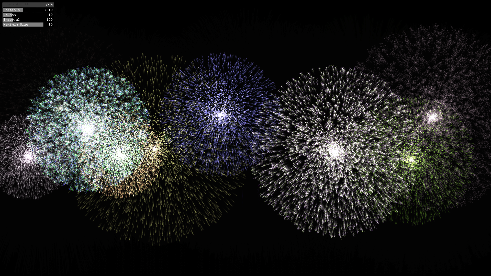
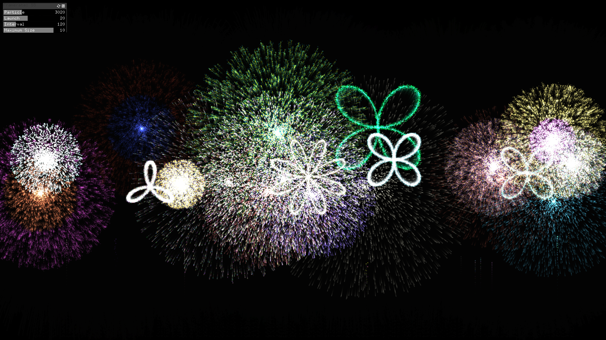

# Fireworks
Simple fireworks on openFrameworks.

## Parameters
Four parameters are controllable.

|Parameters|Contents|
|:---|:---|
|Particle|Number of particles composing a firework (only the backbone part)|
|Launch|Number of fireworks launched at a same time|
|Interval|Launching interval (frame)|
|Maximum size|Maximum size of fireworks|

## Screenshots

